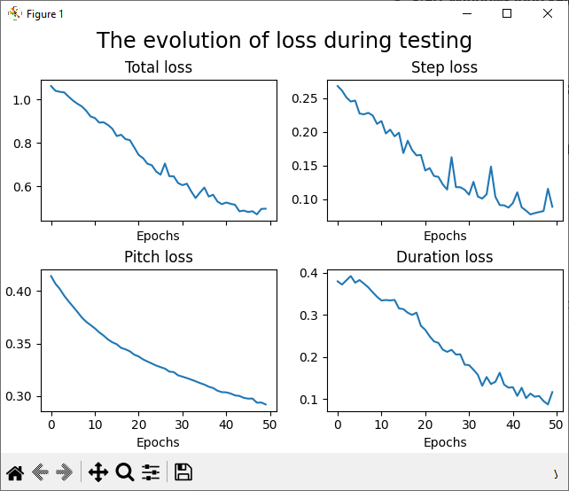
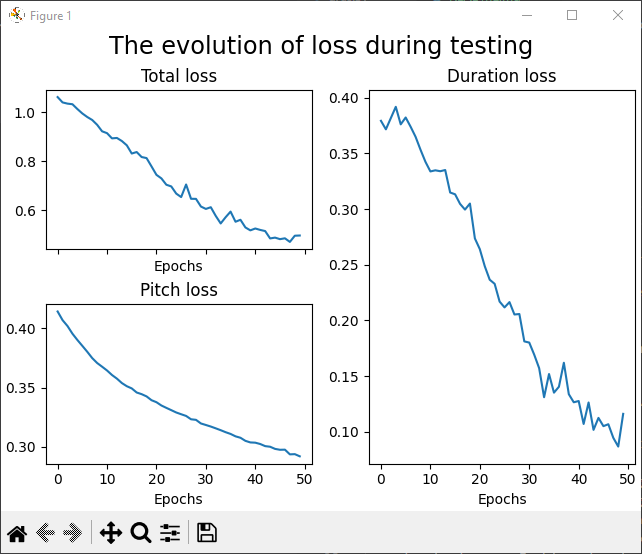
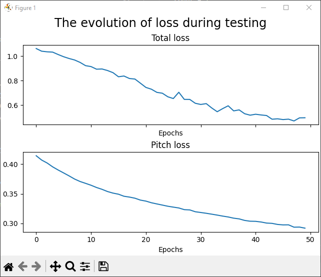
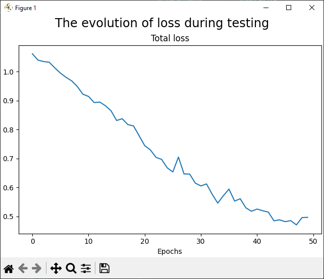

# Music informed neural network for structured music generatio

## Generate Dataset

## Train Network

## Generate Music

## Graph loss
In order to show the loss graphs for a model run `python src/graph.py --model {model_name}`

```
usage: Graph from model [-h] --model str [--models_dir str] [--train bool] [--test bool] [--loss bool] [--pitch bool] [--step bool] [--duration bool]

Generates a series of graphs for the training and testing loss

options:
  -h, --help        show this help message and exit

Params ['params']:
   Parameters for generating loss graphs for the model

  --model str       Sets the model to generate graphs from. (default: None)
  --models_dir str  Sets the models directory. (default: ./models)
  --train bool      Enables graphing for train data. (default: True)
  --test bool       Enables graphing for test data. (default: True)
  --loss bool       Enables loss graph. (default: True)
  --pitch bool      Enables pitch loss graph. (default: True)
  --step bool       Enables step loss graph. (default: True)
  --duration bool   Enables duration loss graph. (default: True)

Oh lord what are you looking for ;-;
```

Graphs will automatically scale depending on the graph types that are currently enabled.  
This can be seen in the images below.

<p float="left">
  
   
</p>
<p float="left">
  
   
</p>